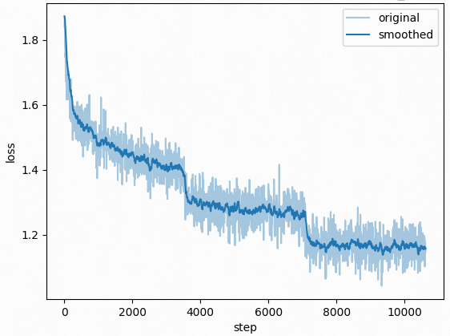

# Qwen2-VL-Med

|Model Name|Download|Loss|
|:-|:-|:-:|
|Qwen2-VL-7B-Med|[Weights](https://modelscope.cn/models/wangrongsheng/Qwen2-VL-7B-Med) / [Checkponints](https://modelscope.cn/models/wangrongsheng/Qwen2-VL-7B-Med-checkpoints)||

## Evaluation

#### Clinical Tasks

|Model Name|Overall|Attribute Recognition|Blood Vessels Recognition|Bone|Cell Recognition|Counting|Disease Diagnosis|Image Quality Grading|Microorganism Recognition|Muscle|Nervous Tissue|Organ Recognition - Abdomen|Organ Recognition - Head and Neck|Organ Recognition - Pelvic|Organ Recognition - Thorax|Severity Grading|Surgeon Action Recognition|Surgical Instrument Recognition|Surgical Workflow Recognition|
|:-:|:-:|:-:|:-:|:-:|:-:|:-:|:-:|:-:|:-:|:-:|:-:|:-:|:-:|:-:|:-:|:-:|:-:|:-:|:-:|
|Qwen2-VL-7B-Instruct|**0.4646**|0.5037|0.4815|0.3829|0.4261|0.3085|0.5386|0.3600|0.4074|0.2600|0.6250|0.5224|0.5032|0.5067|0.5118|0.2768|0.3304|0.2971|0.2857|

#### Departments

|Model Name|Overall|Cardiovascular Surgery|Dermatology|Endocrinology|Gastroenterology and Hepatology|General Surgery|Hematology|Infectious Diseases|Laboratory Medicine and Pathology|Nephrology and Hypertension|Neurosurgery|None|Obstetrics and Gynecology|Oncology (Medical)|Ophthalmology|Orthopedic Surgery|Otolaryngology (ENT)/Head and Neck Surgery|Pulmonary Medicine|Sports Medicine|Urology|
|:-:|:-:|:-:|:-:|:-:|:-:|:-:|:-:|:-:|:-:|:-:|:-:|:-:|:-:|:-:|:-:|:-:|:-:|:-:|:-:|:-:|
|Qwen2-VL-7B-Instruct|**0.4646**|0.7176|0.4486|0.6400|0.4805|0.3260|0.3428|0.5429|0.3813|0.7467|0.8000|0.4133|0.4524|0.4446|0.4472|0.5231|0.5358|0.5768|0.5222|

#### Perceptual Granularities

|Model Name|Overall|Box level|Contour level|Image level|Mask level|
|:-:|:-:|:-:|:-:|:-:|:-:|
|Qwen2-VL-7B-Instruct|**0.4646**|0.3627|0.4815|0.4638|0.4815|

## Citation

If you find our work helpful, feel free to give us a cite.

```bibtex

```

## Acknowledgments

## Contact Us

If you are interested in our project and would like to join us, feel free to send an email to [wrs6@88.com](mailto:wrs6@88.com).

## License

Please follow the Apache 2.0 License.
